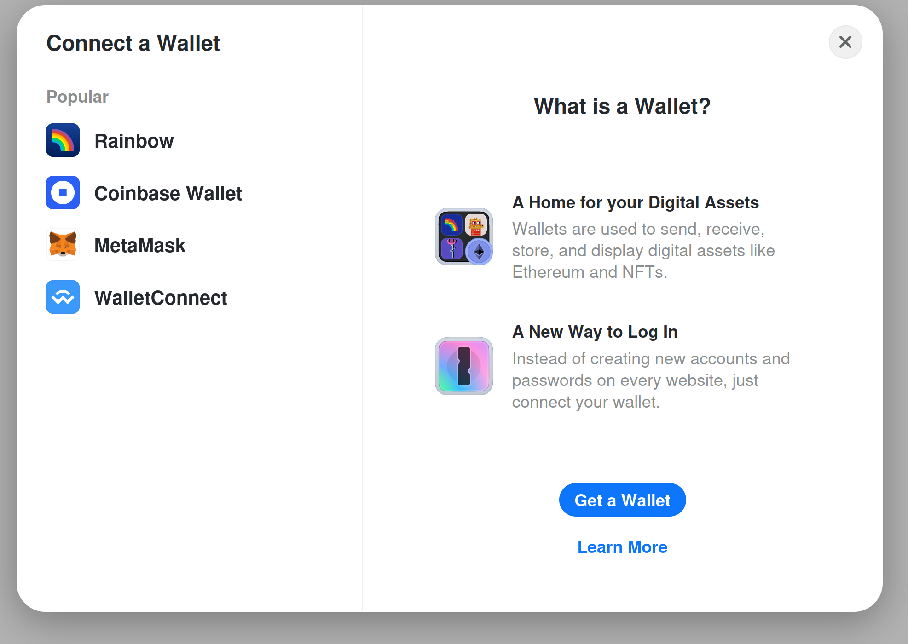
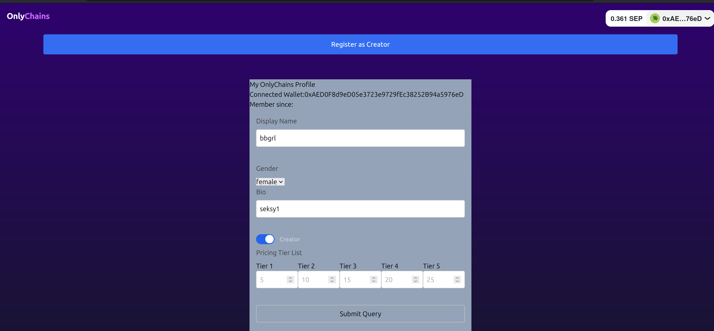
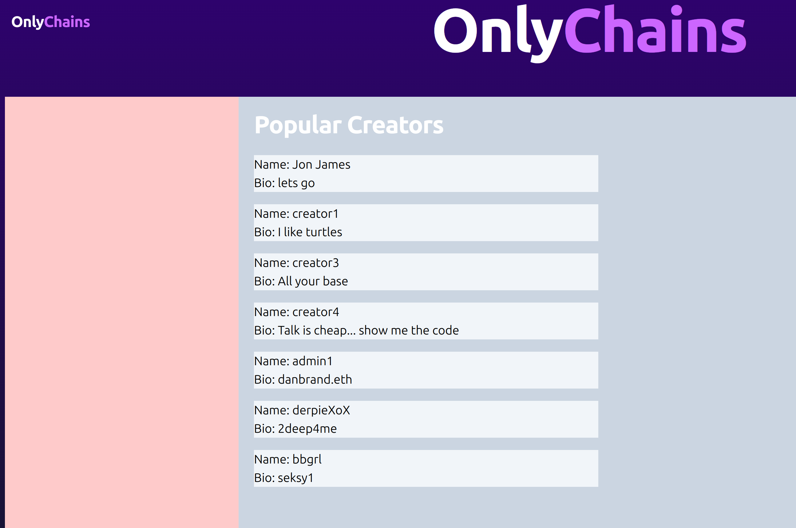
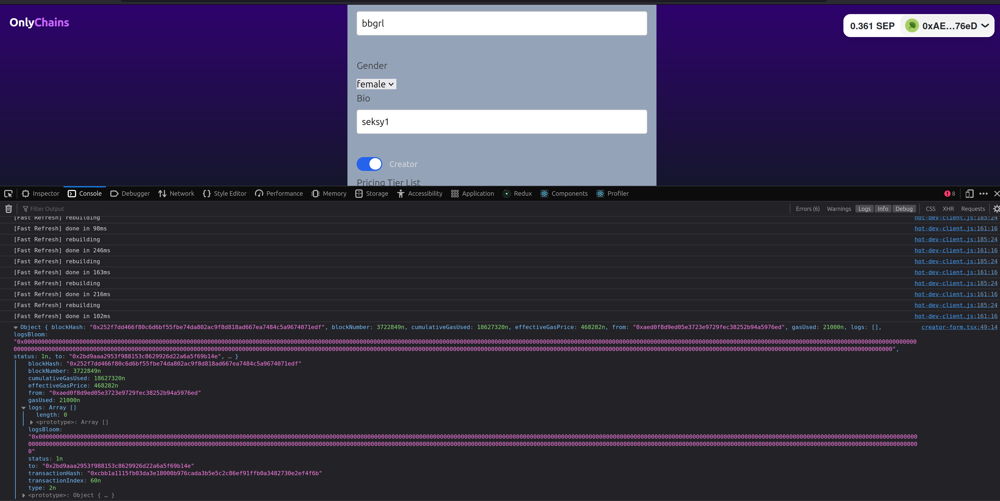
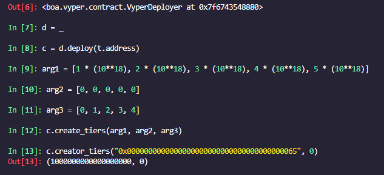

# Ape only your chains

`yarn && yarn dev`

## Features:

* Connect a wallet to verify ownership (MetaMask, Coinbase Wallet, Rainbow, WalletConnect)



* Creator page for each user



* Upload your encrypted photos to decentralized IPFS network
* Unlock a photo/subscribe to individual with a smart contract

* View list of top creators




## MAINNET Smart contracts

`testtoken.sol` - `0xfabeeDC1731A50b227796Fbd624dB0E600d545f2`

`creators.sol` - `0xe8754434a4BA21B0863B215816102E58273BB950`

## Vyper Testnet Contract

https://sepolia.etherscan.io/address/0xc744614ae70b4fd321a22f6035e344a99b43a6b4


* Create pricing tiers on testnet https://sepolia.etherscan.io/tx/0x470719f68d25fbf18057543582d0f3b1e8b51b4514d214f2848602d904a4bced



* Subscribe to a pricing tier https://sepolia.etherscan.io/tx/0x259cdb1cd7d905a0c66a2f98dd6e340c48112679f0b8af52bc97d5c7d4ec3ef0


## Updating your profile as a creator

Can be done through /profile

```json
POST /api/updateProfile
{
displayName: 'bbgrl',
gender: 'female',
bio: 'seksy1',
isCreator: true,
addressETH: '0xAED0F8d9eD05e3723e9729fEc38252B94a5976eD'
}
```

This would interact with the Vyper smart contract and create tiers
https://github.com/danschewy/onlychains/blob/main/smart_contracts/src/Subscription.vy

```python
@external
def create_tiers(amt: DynArray[uint256, 5], dur: DynArray[uint8, 5], tier_index: DynArray[uint8, 5]):
assert len(amt) == len(dur) and len(amt) == len(tier_index)
for i in [0, 1, 2, 3, 4]:
assert dur[i] < 3
tier: Tier = Tier ({amount: amt[i], duration: dur[i]})
self.activated[msg.sender]tier_index[i]] = True
self.creator_tiers[msg.sender]tier_index[i]] = tier
```

Now you can subscribe to these tiers as a USER




```python
@external
def subscribe(creator: address, tier_index: uint8):
time: uint64 = 0
sub_tier: Tier = self.creator_tiers[creator][tier_index]
expiration: uint64 = self.subs[msg.sender][creator].expiration
assert self.activated[msg.sender][tier_index] == True
assert expiration == 0 or convert(block.timestamp, uint64) >= expiration
if sub_tier.duration == 0:
time = WEEK
elif sub_tier.duration == 1:
time = MONTH
else:
time = YEAR
    self.subs[msg.sender][creator].expiration += convert(block.timestamp, uint64) + time
    APE_COIN.transferFrom(msg.sender, creator, sub_tier.amount)
```

## Testing with Foundry

```bash
curl -L https://foundry.paradigm.xyz | bash
#(add installed .foundry folder to path somehow)
foundryup
sudo rm /usr/local/bin/chisel
sudo mv /usr/local/bin/.foundry/bin/\* /usr/local/bin/
source ~/.bashrc
```

* Deploy the test contract

## Updating the prisma schema

`yarn prisma db push`

## API Routes

/post/<id> will bring up a specific item and all the user's posts.

```json
[
  User {
  id: '1',
  role: 'CREATOR',
  image: null,
  displayName: null,
  bio: null,
  addressETH: null,
  addressBTC: null,
  gender: null,
  createdAt: 2023-06-17T20:52:26.558Z,
  language: 'en',
  posts: [{
    id: 1,
    authorId: '1',
    title: 'ti',
    content: 'on here',
    contentPreview: 'on...',
    imagePreview: null,
    postedDate: 2023-06-17T20:55:04.917Z,
    images: [],
    imageAuthor: null,
    authorName: null,
    votes_up: null,
    votes_down: null,
    updatedAt: null
  }]
  }
]
```

# Create T3 App

This is a [T3 Stack](https://create.t3.gg/) project bootstrapped with `create-t3-app`.

## What's next? How do I make an app with this?

We try to keep this project as simple as possible, so you can start with just the scaffolding we set up for you, and add additional things later when they become necessary.

If you are not familiar with the different technologies used in this project, please refer to the respective docs. If you still are in the wind, please join our [Discord](https://t3.gg/discord) and ask for help.

- [Next.js](https://nextjs.org)
- [NextAuth.js](https://next-auth.js.org)
- [Prisma](https://prisma.io)
- [Tailwind CSS](https://tailwindcss.com)
- [tRPC](https://trpc.io)

## Learn More

To learn more about the [T3 Stack](https://create.t3.gg/), take a look at the following resources:

- [Documentation](https://create.t3.gg/)
- [Learn the T3 Stack](https://create.t3.gg/en/faq#what-learning-resources-are-currently-available) — Check out these awesome tutorials

You can check out the [create-t3-app GitHub repository](https://github.com/t3-oss/create-t3-app) — your feedback and contributions are welcome!

## How do I deploy this?

Follow our deployment guides for [Vercel](https://create.t3.gg/en/deployment/vercel), [Netlify](https://create.t3.gg/en/deployment/netlify) and [Docker](https://create.t3.gg/en/deployment/docker) for more information.

## ipfs config

```
...
"API": {
    "HTTPHeaders": {
      "Access-Control-Allow-Methods": [
        "PUT",
        "POST"
      ],
      "Access-Control-Allow-Origin": [
        "https://dev.webui.ipfs.io",
        "http://localhost:3000",
        "http://127.0.0.1:5001",
        "https://webui.ipfs.io"
      ]
    }
  },
...
"Gateway": {
    "APICommands": [],
    "HTTPHeaders": {
      "Access-Control-Allow-Headers": [
        "X-Requested-With",
      	"Access-Control\-Expose\-Headers",
        "Range",
        "User-Agent"
      ],
      "Access-Control-Allow-Methods": [
 	"POST",
        "GET"
      ],
      "Access-Control-Allow-Origin": [
        "*"
      ]
    },
    "NoDNSLink": false,
    "NoFetch": false,
    "PathPrefixes": [],
    "PublicGateways": null,
    "RootRedirect": ""
  },
```

### ipfs setup

run `ipfs daemon` after/before `npm run dev`
